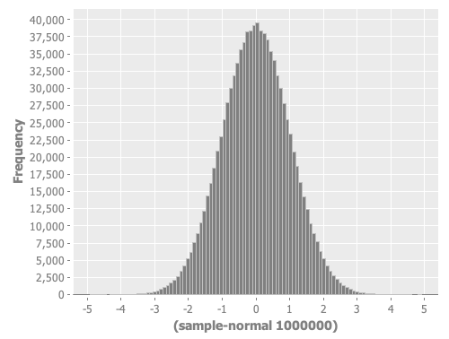

- <a href="http://incanter.org/docs/incanter-cheat-sheet.pdf">cheat sheet</a> (<a href="./incanter/incanter-cheat-sheet.pdf">local save</a>)
- http://incanter.github.io/incanter/index.html
- https://github.com/incanter/incanter/wiki

### Examples:

Normal distribution PDF
```Clojure
user=> (view (histogram (sample-normal 1000000) :nbins 100 :density true))
```

