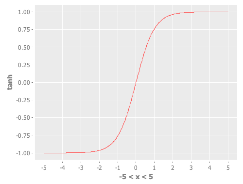

- <a href="http://incanter.org/docs/incanter-cheat-sheet.pdf">cheat sheet</a> (<a href="./incanter/incanter-cheat-sheet.pdf">local save</a>)
- http://incanter.github.io/incanter/index.html
- https://github.com/incanter/incanter/wiki

### Examples:

#### Normal distribution PDF

```Clojure
user=> (view (histogram (sample-normal 10000000 :mean 0 :sd 1) :nbins 1000 :density true :x-label "Normal Distribution PDF"))
```


<hr>

```Clojure
user=> (view (function-plot pdf-normal -5 5))
```


<hr>

#### Hyperbolic tangent PDF

```Clojure
user=> (defn tanh [x] (/ (- (exp x) (exp (* -1 x))) (+ (exp x) (exp (* -1 x)))))
#'user/tanh

user=> (view (function-plot tanh -5 5))
```


