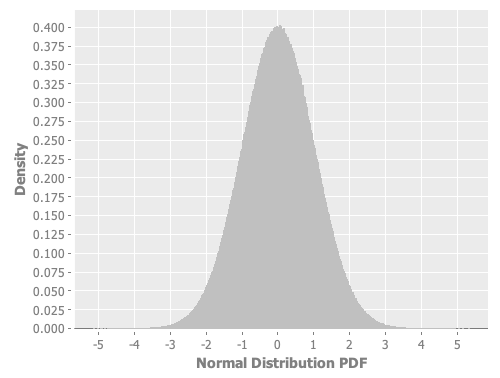
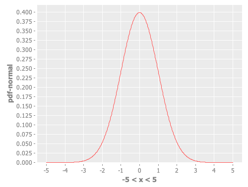
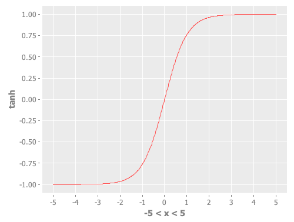
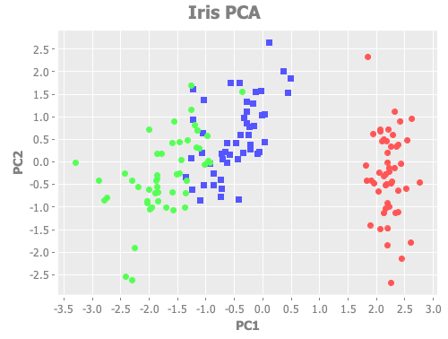

### Links

- <a href="http://incanter.org/docs/incanter-cheat-sheet.pdf">cheat sheet</a> (<a href="./incanter/incanter-cheat-sheet.pdf">local save</a>)
- http://incanter.github.io/incanter/index.html
- https://github.com/incanter/incanter/wiki

<hr>

### Use <a href="https://github.com/incanter/incanter">incanter</a> and <a href="https://mikera.github.io/core.matrix/doc/clojure.core.matrix.html">clojure.core.matrix</a>

##### Method 1: use the clojure 1.2.0 shipped with incanter

1. specify $INCANTER_HOME in the shell configuration file
2. cd $INCANTER_HOME and run <b>script/repl</b>
3. try to load library

```Clojure
user=> (use 'clojure.core.matrix)
nil

user=> (use '(incanter stats charts datasets))
nil
```

<hr>

##### Method 2: use the clojure as installed on the computer

1. lein repl
2. try to load library

```Clojure
user=> (use 'clojure.core.matrix)
nil

user=> (use '(incanter stats charts datasets))
nil
```

If encountering the following error message about classpath

```Clojure
user=> (use '(incanter core stats charts datasets))
Execution error (FileNotFoundException) at user/eval1585 (form-init8310687567371780121.clj:1).
Could not locate incanter/core__init.class, incanter/core.clj or incanter/core.cljc on classpath.
```

Try to modify the ~/.lein/profiles.clj by adding :dependencies, as described <a href="https://github.com/incanter/incanter">here</a>:

```
{:user  {:dependencies [[org.clojure/clojure "1.9.0"]
                        [incanter "1.9.3"]]}}
```

<hr>

### Examples:

#### Normal distribution PDF

##### 1. using <a href="https://incanter.github.io/incanter/stats-api.html">sample-normal</a>

```Clojure
user=> (view (histogram (sample-normal 10000000 :mean 0 :sd 1) :nbins 1000 :density true :x-label "Normal Distribution PDF"))
```


<hr>

##### 2. using <a href="https://incanter.github.io/incanter/stats-api.html">pdf-normal</a>

```Clojure
user=> (view (function-plot pdf-normal -5 5))
```


<hr>

References of incanter <a href="https://incanter.github.io/incanter/stats-api.html">functions</a>

<a href="https://github.com/incanter/incanter/wiki/Probability-Distributions">CDF</a> | <a href="https://github.com/incanter/incanter/wiki/Probability-Distributions">PDF</a> | <a href="https://github.com/incanter/incanter/wiki/Probability-Distributions">sample</a> | distance 
--- | --- | --- | ---
cdf-beta<br/>cdf-binomial<br/>cdf-chisq<br/>cdf-empirical<br/>cdf-exp<br/>cdf-f<br/>cdf-gamma<br/>cdf-neg-binomial<br/>cdf-normal<br/>cdf-poisson<br/>cdf-t<br/>cdf-uniform<br/>cdf-weibull | pdf-beta<br/>pdf-binomial<br/>pdf-chisq<br/>pdf-exp<br/>pdf-f<br/>pdf-gamma<br/>pdf-neg-binomial<br/>pdf-normal<br/>pdf-poisson<br/>pdf-t<br/>pdf-uniform<br/>pdf-weibull | sample<br/>sample-beta<br/>sample-binomial<br/>sample-chisq<br/>sample-dirichlet<br/>sample-exp<br/>sample-gamma<br/>sample-inv-wishart<br/>sample-multinomial<br/>sample-mvn<br/>sample-neg-binomial<br/>sample-normal<br/>sample-permutations<br/>sample-poisson<br/>sample-t<br/>sample-uniform<br/>sample-weibull<br/>sample-wishart | chebyshev-distance<br/>euclidean-distance<br/>hamming-distance<br/>jaccard-distance<br/>lee-distance<br/>levenshtein-distance<br/>mahalanobis-distance<br/>manhattan-distance<br/>minkowski-distance<br/>normalized-kendall-tau-distance

<hr>

#### Hyperbolic tangent PDF

```Clojure
user=> (defn tanh [x] (/ (- (exp x) (exp (* -1 x))) (+ (exp x) (exp (* -1 x)))))
#'user/tanh

user=> (view (function-plot tanh -5 5))
```



<hr>

#### <a href="https://github.com/incanter/incanter/wiki/Matrices">Matrix operation</a>

##### Inverse of a matrix

```Clojure
user=> (def A (matrix (sample-uniform 9) 3))
#'user/A

user=> A
[0.6199 0.0557 0.1063
0.0956 0.6555 0.8251
0.5847 0.2950 0.2554]

user=> (def B (solve A))
#'user/B

user=> B
[ 1.2803 -0.2888  0.4001
-7.7202 -1.6218  8.4506
 5.9848  2.5339 -6.7598]

user=> (mmult A B)
[1.0000 0.0000 0.0000
0.0000 1.0000 0.0000
0.0000 0.0000 1.0000]

user=> (mmult B A)
[ 1.0000  0.0000 0.0000
 0.0000  1.0000 0.0000
-0.0000 -0.0000 1.0000]
```

<hr>

#### Statistics

##### <a herf="https://github.com/incanter/incanter/wiki/Statistics-Examples">PCA</a>

```Clojure
user=> (def iris (to-matrix (get-dataset :iris)))
#'user/iris

user=> (dim iris)
[150 5]

;; standardize speed and dist and append the standardized variables to the original dataset
user=> (def standardized_data (to-matrix (with-data (get-dataset :iris)
                                    (conj-cols $data
                                               (sweep (sweep ($ :Sepal.Length)) :stat sd :fun div)
                                               (sweep (sweep ($ :Sepal.Width))  :stat sd :fun div)
                                               (sweep (sweep ($ :Petal.Length)) :stat sd :fun div)
                                               (sweep (sweep ($ :Petal.Width))  :stat sd :fun div)))))
#'user/standardized_data

;; to see the same results in the hand-crafted results as the function of principal-components, use the range(5 9) version
;;user=> (def X (sel standardized_data :cols (range 5 9)))  ;; column #5 is the class (0,1,2). not using it
user=> (def X (sel standardized_data :cols (range 0 4)))  ;; column #5 is the class (0,1,2). not using it
#'user/X

;;;;;;;;;;;;;;;;;;;;;;;;;;;;;;;;;;;;;;;;;;;;;;;;;;;;;;;;;;;;;;;;;;;;;;;;;;;;;;;;;;;;;;;;;;;;;;;;;;;;;;;;;;;;;;;;;;;;;;;;;;;;;;;;;;;;;;;
;; to calculate PCA by hand, see this: https://machinelearningmastery.com/calculate-principal-component-analysis-scratch-python/
user=> (def nrows (get (dim X) 0))
#'user/nrows

user=> (def colmeans (div (map sum (trans X)) nrows))
#'user/colmeans

user=> colmeans
(5.843333333333335 3.057333333333334 3.7580000000000027 1.199333333333334)

user=> (def colmeans_matrix (mmult (matrix 1 nrows 1) (matrix colmeans 4)))
#'user/colmeans_matrix

user=> (def C (minus X colmeans_matrix))   
#'user/C

user=> (def Q (covariance C))
#'user/Q

user=> Q
[ 0.6857 -0.0424  1.2743  0.5163
-0.0424  0.1900 -0.3297 -0.1216
 1.2743 -0.3297  3.1163  1.2956
 0.5163 -0.1216  1.2956  0.5810]

user=> (div (mmult (trans C) C) (- nrows 1)) # Covariance matrix crafted by hand, Q = X'X / (n-1)
[ 0.6857 -0.0424  1.2743  0.5163
-0.0424  0.1900 -0.3297 -0.1216
 1.2743 -0.3297  3.1163  1.2956
 0.5163 -0.1216  1.2956  0.5810]

user=> (def Eigenvalues (:values (decomp-eigenvalue Q)))
#'user/Eigenvalues

;; Eigenvalues are variances
;; the highest eigenvalue is 4.23, the 4th value, followed by 0.24, the 3rd value
user=> Eigenvalues
(0.02383509297344985 0.07820950004291968 0.24267074792863366 4.228241706034862)

user=> (def Eigenvectors (:vectors (decomp-eigenvalue Q)))
#'user/Eigenvectors

user=> (def L (diag Eigenvalues)) ;; the uppercase greek letter of lambda (Λ)
#'user/L

user=> (sum (diag Q))
4.572957046979864

user=> (sum (diag L))  ;; L captures the variance of Q
4.572957046979866

user=> (def W Eigenvectors)
#'user/W

user=> (mmult W (trans W)) ;; Importantly, WW' = W'W = I as W is orthonormal
[1.0000  0.0000  0.0000  0.0000
0.0000  1.0000 -0.0000 -0.0000
0.0000 -0.0000  1.0000  0.0000
0.0000 -0.0000  0.0000  1.0000]

user=> (mmult (mmult W L) (trans W)) ;; Interestingly, Q = WΛW'
[ 0.6857 -0.0424  1.2743  0.5163
-0.0424  0.1900 -0.3297 -0.1216
 1.2743 -0.3297  3.1163  1.2956
 0.5163 -0.1216  1.2956  0.5810]
 
user=> (mmult (mmult (trans W) Q) W) ;; Interestingly, Λ = W'QW
[0.0238 -0.0000 -0.0000 0.0000
0.0000  0.0782 -0.0000 0.0000
0.0000 -0.0000  0.2427 0.0000
0.0000  0.0000  0.0000 4.2282]

;; based on the descending order of eigenvalues, the 4th col is PC1, the 3rd col is PC2, and so on ...
;; that is, PC1 = [0.3614 -0.0845 0.8567 0.3583]
user=> Eigenvectors
[-0.3155 -0.5820 -0.6566  0.3614
 0.3197  0.5979 -0.7302 -0.0845
 0.4798  0.0762  0.1734  0.8567
-0.7537  0.5458  0.0755  0.3583]

;; this is equivalent to R's prcomp(center = T, scale. = F)
;; PC1
user=> (sel Eigenvectors :cols 3) 
[ 0.3614
-0.0845
 0.8567
 0.3583]
 
;;;;;;;;;;;;;;;;;;;;;;;;;;;;;;;;;;;;;;;;;;;;;;;;;;;;;;;;;;;;;;;;;;;;;;;;;;;;;;;;;;;;;;;;;;;;;;;;;;;;;;;;;;;;;;;;;;;;;;;;;;;;;;;;;;;;;;;

user=> (source principal-components) ;; one can see that decomp-svd, not decomp-eigenvalue, is used in this function
(defn principal-components
" ... (skiped ... "
  ([x & options]
   (let [svd (decomp-svd (correlation x))
         rotation (:V svd)
         std-dev (sqrt (:S svd))]
     {:std-dev std-dev
      :rotation rotation})))
nil

;; this is equivalent to R's prcomp(center = T, scale. = T)
user=> (def pc_results (principal-components X)) 
#'user/pc_results

user=> pc_results
{:std-dev (1.7083611493276223 0.9560494084868573 0.38308860015839086 0.14392649661761264), :rotation [-0.5211 -0.3774  0.7196  0.2613
 0.2693 -0.9233 -0.2444 -0.1235
-0.5804 -0.0245 -0.1421 -0.8014
-0.5649 -0.0669 -0.6343  0.5236]
}

user=> (def eigenvalues (pow (:std-dev pc_results) 2))
#'user/eigenvalues

user=> eigenvalues
(2.9184978165319944 0.9140304714680697 0.14675687557131548 0.020714836428619664)

;; https://stats.stackexchange.com/questions/22569/pca-and-proportion-of-variance-explained
user=> (sum eigenvalues) ;; sum of eigenvalues is the sum of the diagnoal of the correlation matrix = 4
3.999999999999999

;; R is a p-by-p matrix of weights whose columns are the eigenvectors of X'X 
user=> (def R (:rotation pc_results))
#'user/R

user=> R  ;; the rotation matrix, 4 x 4
[-0.5211 -0.3774  0.7196  0.2613
 0.2693 -0.9233 -0.2444 -0.1235
-0.5804 -0.0245 -0.1421 -0.8014
-0.5649 -0.0669 -0.6343  0.5236]

user=> (solve R) ;; 
[-0.5211  0.2693 -0.5804 -0.5649
-0.3774 -0.9233 -0.0245 -0.0669
 0.7196 -0.2444 -0.1421 -0.6343
 0.2613 -0.1235 -0.8014  0.5236]
 
user=> (trans R) ;; the rotation matrix is orthonormal, as (solve R) = (trans R)
[-0.5211  0.2693 -0.5804 -0.5649
-0.3774 -0.9233 -0.0245 -0.0669
 0.7196 -0.2444 -0.1421 -0.6343
 0.2613 -0.1235 -0.8014  0.5236]

user=> (mmult (trans R) R) ;; the rotation matrix is orthonormal, as R'R = I
[ 1.0000 -0.0000 -0.0000 -0.0000
-0.0000  1.0000 -0.0000 -0.0000
-0.0000 -0.0000  1.0000  0.0000
-0.0000 -0.0000  0.0000  1.0000]

user=> (def v1 (sel R :cols 0))  ;; the eigenvector corresponding to the 1st eigenvalue
#'user/v1

user=> (def v2 (sel R :cols 1))  ;; the eigenvector corresponding to the 2nd eigenvalue
#'user/v2

;; this is to make the plot (pc1, pc2) on a standardized scale only. it does not change the results of the function of principal-components when using unstandardized X
user=> (def X_standardized (sel standardized_data :cols (range 5 9)))
#'user/X_standardized

;; see Dimensionality reduction in https://en.wikipedia.org/wiki/Principal_component_analysis 
;; the transformation T = X R maps a data vector x(i) from an original space of p variables to a new space of p variables which are uncorrelated over the dataset.
user=> (def pc1 (mmult X_standardized v1))  ;; X should be standardized first
#'user/pc1

user=> (def pc2 (mmult X_standardized v2))  ;; X should be standardized first
#'user/pc2

user=> (nth eigenvalues 0)
2.9184978165319944

user=> (variance pc1) ;; Var(PC_k) = lambda_k
2.9184978165319966

user=> (doto (scatter-plot (sel pc1 :rows (range 0 50)) (sel pc2 :rows (range 0 50))
                    :x-label "PC1" :y-label "PC2" :title "Iris PCA")
      (add-points (sel pc1 :rows (range 50 100)) (sel pc2 :rows (range 50 100)))
      (add-points (sel pc1 :rows (range 100 150)) (sel pc2 :rows (range 100 150)))
      view)
```


